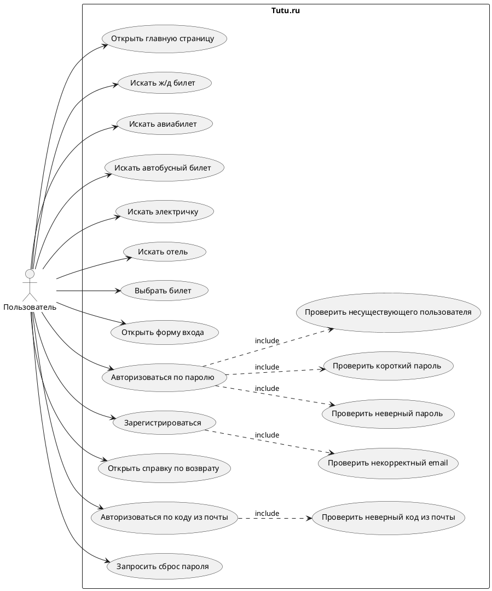

# Лабораторная работа 3

## Текст задания

Вариант 1230: Tutu.Ru, https://www.tutu.ru/.

Нужно сформировать варианты использования, разработать на их основе тестовое покрытие и провести функциональное тестирование интерфейса сайта. Тестирование выполняется автоматически с помощью Selenium, элементы страницы выбираются через XPath. В покрытие включены регистрация, авторизация по паролю и коду из почты, поиск и выбор билетов, включая негативные проверки: неверный пароль, неверный код из почты, несуществующая почта, некорректный email и запрос сброса пароля.

## Use Case-диаграмма



## CheckList тестового покрытия

| ID | Проверка | Ожидаемый результат | Автотест |
|---|---|---|---|
| CL-01 | Переход в раздел ж/д билетов | Открывается форма/страница поиска поездов | `test_tc01_go_to_railway_tickets` |
| CL-02 | Поиск ж/д маршрута Москва - Санкт-Петербург | После нажатия кнопки появляется датированная выдача с выбором мест | `test_tc02_successful_railway_search` |
| CL-03 | Поиск ж/д без обязательных полей | После нажатия не открывается полноценная датированная выдача с выбором мест | `test_tc03_empty_railway_search_validation` |
| CL-03A | Поиск ж/д только с полем "Откуда" | После нажатия не открывается полноценная датированная выдача с выбором мест | `test_tc03_railway_origin_only_validation` |
| CL-03B | Поиск ж/д только с полем "Куда" | После нажатия не открывается полноценная датированная выдача с выбором мест | `test_tc03_railway_destination_only_validation` |
| CL-03C | Поиск ж/д с несуществующей станцией | После нажатия не открывается полноценная датированная выдача с выбором мест | `test_tc03_railway_invalid_origin_validation` |
| CL-04 | Поиск автобусного маршрута | Появляется страница рейсов/билетов | `test_tc04_bus_search` |
| CL-05 | Открытие возврата автобусного билета | Открывается сценарий возврата/поиска заказа | `test_tc05_bus_ticket_refund` |
| CL-06 | Переход в авиабилеты | Открывается форма поиска авиабилетов | `test_tc06_go_to_avia_tickets` |
| CL-07 | Поиск авиабилета туда-обратно с пассажирами | Заполнены откуда/куда, даты туда и обратно, 2 пассажира; появляется авиа-выдача | `test_tc07_avia_search` |
| CL-07A | Поиск авиабилета с пустой формой | Форма остается на странице и подсвечивает обязательные поля | `test_tc07_avia_empty_search_validation` |
| CL-07B | Поиск авиабилета только с полем "Откуда" | Форма остается на странице и подсвечивает незаполненные обязательные поля | `test_tc07_avia_origin_only_validation` |
| CL-07C | Поиск авиабилета только с полем "Куда" | Форма остается на странице и подсвечивает незаполненные обязательные поля | `test_tc07_avia_destination_only_validation` |
| CL-07D | Поиск авиабилета с маршрутом без дат | Форма остается на странице и подсвечивает незаполненные обязательные поля | `test_tc07_avia_route_without_dates_validation` |
| CL-08 | Поиск электрички | Появляется расписание электричек | `test_tc08_suburban_train_search` |
| CL-09 | Поиск отеля | Появляется форма/выдача отелей | `test_tc09_hotel_search` |
| CL-10 | Применение фильтра в выдаче | Фильтр доступен, выдача остается на странице | `test_tc10_results_filter` |
| CL-11 | Открытие карточки результата | Открываются детали билета/поезда | `test_tc11_open_result_card` |
| CL-12 | Открытие формы авторизации | Видна форма входа | `test_tc12_authorization_form` |
| CL-13 | Справка по возврату | Открывается материал/раздел возврата | `test_tc13_help_refund_topic` |
| CL-14 | Вход с некорректным email | Показывается ошибка формата email | `test_tc14_login_invalid_email` |
| CL-15 | Вход с несуществующим пользователем | Показывается ошибка или переход к коду/регистрации | `test_tc15_login_nonexistent_user` |
| CL-16 | Вход с неверным паролем | Показывается ошибка авторизации | `test_tc16_login_wrong_password` |
| CL-17 | Вход с коротким паролем | Показывается ошибка пароля или актуальный code-flow | `test_tc17_login_short_password` |
| CL-18 | Регистрация с некорректным email | Показывается ошибка формата email | `test_tc18_registration_invalid_email` |
| CL-19 | Выбор ж/д билета из выдачи | Открывается выбор места/оформление | `test_tc19_choose_railway_ticket` |
| CL-20 | Вход с неверным кодом из почты | Показывается ошибка кода | `test_tc20_login_wrong_email_code` |
| CL-21 | Запрос сброса пароля | Отправляется код, открывается экран ввода кода и кнопка восстановления | `test_tc21_password_reset_request` |
| CL-22 | Успешная авторизация по почте и коду из письма | После ручного ввода кода открывается личный кабинет/профиль | `test_tc22_successful_authorization_by_email_code` |
| CL-23 | Успешная авторизация по почте и паролю | Открывается личный кабинет/профиль | `test_tc23_successful_authorization_by_password` |
| CL-24 | Авиа: выдача, карточки, фильтр, подробности, оформление без оплаты | Загружается выдача, карточки содержат маршрут/цену/детали, выполняется переход к оформлению и заполнение данных до шага оплаты | `test_tc24_avia_results_filter_details_and_checkout` |
| CL-25 | Ж/д: выдача, карточки, сортировка/порядок, фильтр, подробности, оформление без оплаты | Загружается выдача поездов, карточки содержат места/цены/время, доступен переход к оформлению | `test_tc25_railway_results_sort_filter_details_and_checkout` |
| CL-26 | Автобусы: пустой поиск | Форма остается на странице и показывает обязательные поля | `test_tc26_bus_empty_search_validation` |
| CL-27 | Автобусы: выдача, карточки, сортировка, фильтр, подробности, оформление без оплаты | Загружается выдача автобусов, карточки содержат рейс/цену/время, открывается оформление места | `test_tc27_bus_results_sort_filter_details_and_checkout` |
| CL-28 | Электрички: пустой поиск | Форма остается на странице и показывает обязательные поля | `test_tc28_suburban_empty_search_validation` |
| CL-29 | Электрички: выдача, карточки, фильтр, подробности | Загружается расписание, строки содержат время/цену/тип, доступна ссылка на подробности рейса | `test_tc29_suburban_results_sort_filter_and_details` |
| CL-30 | Отели: пустой поиск | Форма остается на странице и показывает поля направления/дат/гостей | `test_tc30_hotel_empty_search_validation` |
| CL-31 | Отели: выдача, карточки, сортировка, фильтр, подробности, бронирование без оплаты | Загружается выдача отелей, карточки содержат рейтинг/цену/ночь, открывается бронирование | `test_tc31_hotel_results_sort_filter_details_and_checkout` |
| CL-32 | Туры: пустой поиск | Форма остается на странице и показывает поля страны/дат/туристов | `test_tc32_tours_empty_search_validation` |
| CL-33 | Туры: выдача, карточки, сортировка/порядок, фильтр, подробности, выбор без оплаты | Загружается выдача туров, карточки содержат отель/дату/цену, доступен выбор тура | `test_tc33_tours_results_sort_filter_details_and_checkout` |

## Описание набора тестовых сценариев

Шаблоны Selenium IDE сохранены в `selenium_ide/tutu_lab3.side`. Исполняемый набор реализован на Python, Selenium WebDriver и pytest. Структура использует Page Object: общие операции находятся в `pages/base_page.py`, доменные действия вынесены в страницы `MainPage`, `RailwayPage`, `AviaPage`, `BusPage`, `SuburbanPage`, `HotelPage`, `ToursPage`, `HelpPage`, `AuthPage`.

Все локаторы в сценариях заданы через XPath. Для динамических элементов используются устойчивые условия: `data-ti`, текст кнопок, `role`, `aria-label`, `placeholder`, видимость и кликабельность. Для позитивной авторизации пароль хранится в локальном `.env`, который игнорируется git, и автоматически мапится в `TUTU_LOGIN`/`TUTU_EMAIL`/`TUTU_PASSWORD`. Для входа по почте и коду тест отправляет код на почту и ожидает ручной ввод в терминале.

Для понятности прогона в `BasePage` добавлен пошаговый лог `[STEP ...]`, а перед кликами Selenium делает паузу 1 секунду. Поэтому видимый запуск показывает не только браузер, но и текущую бизнес-операцию в терминале.

Команды запуска:

```bash
pip install -r requirements.txt
pytest -v --browser chrome --headless
pytest -v --browser firefox --headless
TUTU_LOGIN="email@example.com" TUTU_PASSWORD="password" pytest -v --browser chrome --headless -k successful_authorization
TUTU_LOGIN="email@example.com" TUTU_INTERACTIVE_AUTH=1 pytest -s -v --browser chrome -k email_code
pytest -s -q --browser chrome -k "tc24 or tc25 or tc26 or tc27 or tc28 or tc29 or tc30 or tc31 or tc32 or tc33"
pytest -s -q --browser chrome --headless -k "tc02 or tc03 or tc24 or tc25"
```

Для параллельного запуска в двух браузерах:

```bash
./run_tests_ubuntu.sh
```

## Результаты тестирования

В текущем рабочем окружении 27.05.2026 выполнен полный Selenium-запуск в Chrome и Firefox. Из-за глобальных `HTTP_PROXY`/`HTTPS_PROXY` в окружении в `conftest.py` добавлена защита `NO_PROXY` для `localhost`, `127.0.0.1` и `::1`, чтобы Selenium не отправлял локальное соединение с WebDriver через внешний proxy.

```bash
.venv/bin/python -m compileall pages tests conftest.py
.venv/bin/python -m pytest -v --browser chrome --headless
.venv/bin/python -m pytest -v --browser firefox --headless
```

Результаты:

```text
Chrome:  21 passed, 2 skipped in 324.10s
Firefox: 21 passed, 2 skipped in 352.05s
Avia Chrome after extension: 7 passed, 21 deselected in 12.53s
Avia visible Chrome after extension: 7 passed, 21 deselected in 12.71s
Avia Firefox after extension: 7 passed, 21 deselected in 26.36s
Results block Chrome headless: 10 passed, 28 deselected in 529.99s
Results block visible Chrome with step logs: 10 passed, 28 deselected in 486.73s
Railway negative Chrome: 4 passed, 37 deselected in 75.43s
Avia checkout Chrome: 1 passed, 40 deselected in 171.69s
Key avia/railway Chrome: 7 passed, 34 deselected in 335.15s
Avia positive/negative Chrome: 5 passed, 35 deselected in 100.04s
Auth reset avia hotels visible Chrome: 19 passed, 1 skipped, 20 deselected in 466.14s
```

TC-22 пропущен без успешной отправки кода и ручного ввода кода из письма. Во время проверки Tutu.ru вернул защитное ограничение `Превышено число попыток`, поэтому интерактивный позитивный вход по коду нужно повторить позже командой с `TUTU_LOGIN`/`TUTU_EMAIL` и `TUTU_INTERACTIVE_AUTH=1`. В последнем прогоне 28.05.2026 остальные проверки авторизации, восстановления пароля, авиа и отелей прошли: `19 passed, 1 skipped, 20 deselected`.

После добавления локального `.env` позитивный вход по почте и паролю проверен отдельно:

```text
test_tc23_successful_authorization_by_password[chrome]: PASSED
```

## Выводы

По набору прецедентов сформировано покрытие основных пользовательских потоков Tutu.ru: навигация, поиск транспорта и отелей, фильтрация, открытие карточки, выбор билета, справка, авторизация по паролю, авторизация по почтовому коду, регистрационный code-flow для новой почты, неверный код и сброс пароля. Автотесты используют Selenium и XPath-локаторы, что соответствует условию о динамически генерируемых элементах. Главный риск набора - внешний сайт может менять тексты, AB-варианты и auth-flow, поэтому локаторы сделаны через несколько XPath-кандидатов и проверки по нескольким ожидаемым словам.
